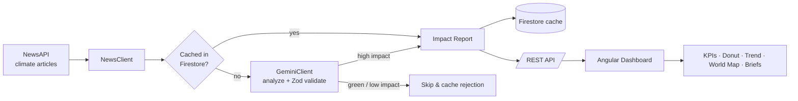
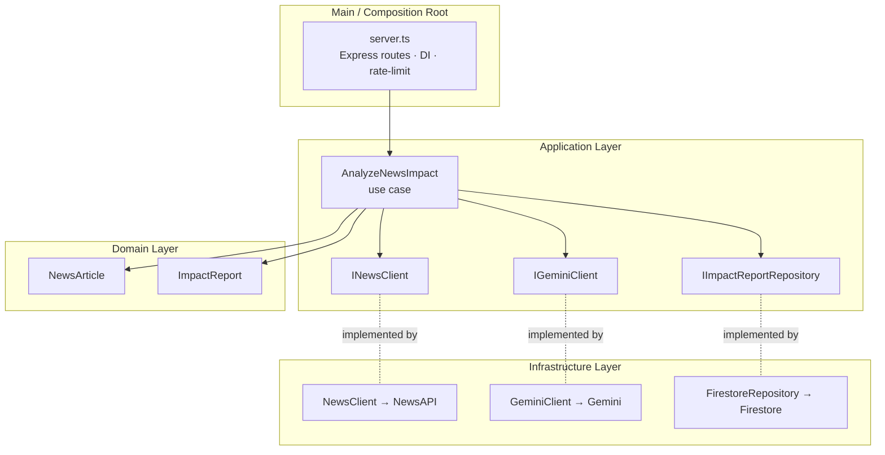

# 🌍 EchoMetrics

> **See what global moves cost the planet.** EchoMetrics turns abstract climate news into human‑scale impact you can actually feel.

EchoMetrics is a full‑stack **climate impact & news intelligence dashboard**. It ingests real‑world climate, energy, and environmental news, uses Google's **Gemini** model to estimate the ecological cost of each event, and translates that cost into relatable comparisons — *oxygen claimed from people, glacier ice melted, city‑park cooling erased, and lifetime commute pollution* — alongside interactive global emissions analytics.

<p align="center">
  
  
  
  
  
  
</p>

---

## 📑 Table of Contents

- [The Problem](#-the-problem)
- [The Solution](#-the-solution)
- [Key Features](#-key-features)
- [How It Works](#-how-it-works)
- [Architecture](#-architecture)
- [Tech Stack](#-tech-stack)
- [Project Structure](#-project-structure)
- [API Reference](#-api-reference)
- [Getting Started](#-getting-started)
- [Operating Modes](#-operating-modes-offline-vs-live)
- [Environment Variables](#-environment-variables)
- [Testing & Coverage](#-testing--coverage)
- [Deployment](#-deployment)
- [Architecture Decision Records](#-architecture-decision-records)

---

## 🎯 The Problem

Climate reporting is **abstract**. A headline like *"new data‑center cluster will emit 185,000 t of CO₂"* means almost nothing to a typical reader — the numbers are too large, too remote, and too easy to scroll past. As a result:

- People struggle to **compare** the relative impact of different events (a sporting mega‑event vs. an AI build‑out vs. a policy rollback).
- Positive and negative climate stories blur together, making it hard to see where the real carbon burden is being created.
- Raw emissions figures rarely translate into **personal or civic action**.

## 💡 The Solution

EchoMetrics closes the gap between *data* and *intuition*:

1. **Curate** — pulls fresh climate/energy/environment news from NewsAPI.
2. **Analyze** — sends each article to **Gemini**, which estimates carbon intensity, CO₂‑equivalent, glacier melt, forest impact, a category, and whether the event is globally significant.
3. **Filter** — automatically discards positive/green stories and low‑impact noise, keeping only **high‑emission, globally relevant** events (and caches the verdict so nothing is re‑analyzed).
4. **Translate** — converts CO₂‑equivalent into four **human‑scale metrics** everyone understands.
5. **Visualize** — presents it all on a reactive dashboard with KPIs, a sector breakdown, a 10‑year global trend, an interactive world emissions map, and a community "protest" signal.

### The four human‑scale metrics

| Metric | Question it answers | Basis |
| --- | --- | --- |
| 💨 **Air** | Whose yearly oxygen does this claim? | `co2eq / 15.3` people |
| 💧 **Water** | How much glacier ice does this melt? | `(co2eq × 3) / 2,500,000` Olympic pools |
| 🌳 **Land** | How much city‑park cooling does this erase? | `co2eq / 36,800` parks |
| 🚗 **Habit** | How many years of car commuting equals this? | `co2eq / 525.7` years |

---

## ✨ Key Features

- **AI‑powered impact scoring** — Gemini 2.5 Flash with a strict JSON contract validated by [Zod](https://zod.dev) (malformed or out‑of‑range responses are rejected).
- **Negative‑event filtering** — green/offset stories are skipped server‑side to keep the feed focused on what's increasing the carbon burden.
- **Smart caching** — every article verdict (including "rejected") is cached in Firestore, so the Gemini API is never billed twice for the same story, and the feed self‑populates in the background when sparse.
- **Interactive analytics** — sector‑share donut, 10‑year global carbon trend (Chart.js), and a scrubable SVG **world emissions map** with per‑country trend charts.
- **Community signal** — readers can "protest" an event; votes are persisted in `localStorage` and ranked by topic pressure.
- **Offline‑first demo mode** — runs with zero API keys using bundled mock data, so the app is always presentable.
- **Resilient by design** — Helmet, CORS allow‑listing, rate limiting, graceful fallbacks, and a 100%‑covered backend.

---

## 🔄 How It Works



**Request flow for the feed:**

1. The Angular app calls `GET /api/reports`.
2. The backend returns cached, filtered negative‑impact reports from Firestore.
3. If fewer than 15 qualifying reports exist, it kicks off a **background** fetch‑and‑analyze cycle (NewsAPI → Gemini → Firestore) without blocking the response.
4. The frontend maps each report to a topic, computes the human‑scale KPIs reactively via Angular Signals, and renders.

---

## 🏛 Architecture

The backend follows **Clean Architecture** — business logic is fully decoupled from Express, Firestore, Gemini, and NewsAPI, which makes every boundary mockable and independently testable (see [ADR‑0001](docs/adr/0001-clean-architecture.md)).



| Layer | Responsibility | Depends on |
| --- | --- | --- |
| **Domain** | Pure entities (`NewsArticle`, `ImpactReport`) and types. No framework code. | nothing |
| **Application** | Use cases (`AnalyzeNewsImpact`) + interfaces (`INewsClient`, `IGeminiClient`, `IImpactReportRepository`). Orchestrates the business rules. | Domain |
| **Infrastructure** | Concrete adapters: `NewsClient`, `GeminiClient`, `FirestoreRepository`. | Application interfaces |
| **Main** | `server.ts` wires everything together, defines routes, security, and DI. | all layers |

The **frontend** uses Angular standalone components with **Signals** for fine‑grained reactive state (no NgRx), and RxJS for HTTP streams — see [ADR‑0002](docs/adr/0002-state-management.md). Server‑Side Rendering (SSR) is enabled for fast first paint and SEO.

---

## 🧰 Tech Stack

| Area | Technologies |
| --- | --- |
| **Backend** | Node.js 22, Express, TypeScript, Zod (validation), Helmet, express‑rate‑limit, CORS |
| **AI / Data** | Google Gemini 2.5 Flash (`@google/generative-ai`), NewsAPI, World Bank Open Data |
| **Persistence** | Cloud Firestore (`firebase-admin`) |
| **Frontend** | Angular 21 (standalone + Signals), RxJS, Chart.js, Angular SSR |
| **Testing** | Jest + ts‑jest + Supertest (backend), Karma + Jasmine (frontend) |
| **Tooling** | npm workspaces (monorepo), Prettier, Docker |

---

## 📁 Project Structure

```
echometrics/
├── backend/                        # Express + TypeScript API (Clean Architecture)
│   ├── src/
│   │   ├── domain/entities/        # NewsArticle, ImpactReport
│   │   ├── application/
│   │   │   ├── interfaces/         # INewsClient, IGeminiClient, IImpactReportRepository
│   │   │   └── use-cases/          # AnalyzeNewsImpact
│   │   ├── infrastructure/
│   │   │   ├── services/           # NewsClient, GeminiClient
│   │   │   └── database/           # FirestoreRepository
│   │   └── main/                   # server.ts, country-emissions.ts
│   ├── tests/                      # Jest specs (100% coverage)
│   └── test-data.json              # Mock data for offline mode
├── frontend/                       # Angular 21 dashboard (SSR)
│   └── src/app/
│       ├── core/                   # models + ImpactService (HTTP)
│       ├── features/net-impact-feed/   # main dashboard component
│       └── shared/components/impact-card/
├── docs/adr/                       # Architecture Decision Records
└── package.json                    # npm workspaces root
```

---

## 🔌 API Reference

Base URL: `http://localhost:3000`. All `/api/*` routes are rate‑limited to **100 requests / 15 min / IP**.

| Method | Endpoint | Description |
| --- | --- | --- |
| `GET` | `/health` | Liveness probe → `{ status: "ok", time }` |
| `GET` | `/api/reports` | Cached, filtered negative‑impact reports (auto‑populates in the background when sparse) |
| `POST` | `/api/analyze` | Run the fetch → analyze pipeline. Body: `{ "q"?: string }` (2–100 chars) |
| `GET` | `/api/climate-history` | 10‑year global CO₂ series (World Bank live, static fallback) |
| `GET` | `/api/country-emissions` | Per‑country 10‑year emissions, per‑capita, and global share |

<details>
<summary>Example: <code>GET /api/reports</code> response</summary>

```json
[
  {
    "id": "report-news-abc",
    "articleId": "news-abc",
    "articleTitle": "Global AI Data Center Expansion Faces Resistance",
    "articleUrl": "https://...",
    "carbonIntensity": 84,
    "co2EquivalentKg": 185000,
    "glacierMeltMm": 4.7,
    "forestImpactSqM": -7400,
    "explanation": "High-intensity electricity and water use for cooling...",
    "category": "Energy",
    "analyzedAt": "2026-06-15T11:45:00.000Z",
    "isGlobalEvent": true
  }
]
```
</details>

---

## 🚀 Getting Started

### Prerequisites

- **Node.js 22+** and npm
- (Optional, for live mode) a **Gemini API key**, a **NewsAPI key**, and a **Firebase/Firestore** project
- (For frontend tests) **Google Chrome** installed

### 1. Install

```bash
git clone <your-repo-url> echometrics
cd echometrics
npm install            # installs all workspaces (backend + frontend)
```

### 2. Run in offline demo mode (no keys needed)

The backend defaults to **offline mode**, serving bundled mock data from `backend/test-data.json`.

```bash
npm run backend:dev        # API on http://localhost:3000
npm run frontend:start     # Dashboard on http://localhost:4200
```

Open <http://localhost:4200> — the dashboard is fully interactive against the mock feed.

### 3. Run in live mode (real news + AI)

Create `backend/.env` (see [Environment Variables](#-environment-variables)), set `LIVE=true`, then start the backend. It will fetch from NewsAPI, analyze with Gemini, and persist to Firestore.

---

## 🔀 Operating Modes (Offline vs Live)

The single `LIVE` environment variable switches the backend between two modes:

| | **Offline (default)** | **Live (`LIVE=true`)** |
| --- | --- | --- |
| Data source | `backend/test-data.json` | NewsAPI + Gemini + Firestore |
| External keys | none required | Gemini, NewsAPI, Firebase |
| Use case | demos, local dev, CI | production / real analysis |

This keeps the app **always demoable** and the test suite **hermetic**, while the same code paths power production.

---

## 🔑 Environment Variables

Set these in `backend/.env` (the file is git‑ignored — never commit real keys).

| Variable | Required | Description |
| --- | --- | --- |
| `LIVE` | no | `true` enables live news/AI/DB; anything else = offline mock mode |
| `PORT` | no | API port (default `3000`; `8080` in Docker) |
| `ALLOWED_ORIGINS` | no | Comma‑separated CORS allow‑list (default `*`) |
| `GEMINI_API_KEY` | live only | Google Generative AI key |
| `NEWS_API_KEY` | live only | NewsAPI key |
| `FIREBASE_PROJECT_ID` | live only | Firestore project id |
| `FIREBASE_CLIENT_EMAIL` | live only | Service‑account email |
| `FIREBASE_PRIVATE_KEY` | live only | Service‑account private key (`\n`‑escaped) |
| `GOOGLE_APPLICATION_CREDENTIALS` | alt. to above | Path to a service‑account JSON (e.g. on Cloud Run) |
| `GOOGLE_CLOUD_PROJECT` | alt. | Project id when using ADC |

> The frontend currently targets `http://localhost:3000/api`; point it at your deployed API in `frontend/src/app/core/services/impact.service.ts`.

---

## 🧪 Testing & Coverage

**Backend — 100% coverage**, enforced by a Jest threshold (branches/functions/lines/statements):

```bash
npm run backend:test
```

**Frontend** — headless Karma + Jasmine. Set `CHROME_BIN` to your Chrome executable if it isn't auto‑detected:

```bash
# Windows (PowerShell)
$env:CHROME_BIN = "C:\Program Files\Google\Chrome\Application\chrome.exe"
npm run frontend:test
```

All measured frontend units are at 100%. The chart/SVG/SSR‑heavy `net-impact-feed` view shell is intentionally excluded from the coverage metric but still has a full behavioral spec.

---

## 📦 Deployment

Both apps ship with multi‑stage **Dockerfiles** (Node 22 Alpine, port `8080`), suitable for Cloud Run or any container host:

```bash
# Backend
docker build -t echometrics-api ./backend
docker run -p 8080:8080 --env-file ./backend/.env echometrics-api

# Frontend (SSR)
docker build -t echometrics-web ./frontend
docker run -p 8080:8080 echometrics-web
```

Production builds without Docker:

```bash
npm --prefix backend run build && npm --prefix backend start
npm --prefix frontend run build   # SSR output in frontend/dist/frontend
```

---

## 📚 Architecture Decision Records

- [ADR‑0001 — Clean Architecture](docs/adr/0001-clean-architecture.md)
- [ADR‑0002 — Angular State Management (Signals + RxJS)](docs/adr/0002-state-management.md)

---

<p align="center"><i>Built to make the cost of a headline impossible to ignore.</i></p>
